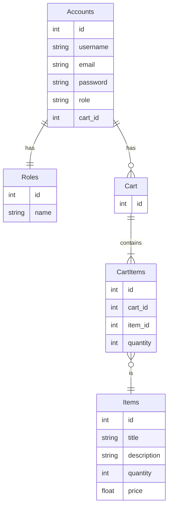

```mermaid
erDiagram
    Accounts ||--|| Roles : "has"
    Accounts ||--o{ Cart : "has"
    Cart ||--|{ CartItems : "contains"
    CartItems }o--|| Items : "is"
    Accounts {
        int id
        string username
        string email
        string password
        string role
        int cart_id
    }
    Roles {
        int id
        string name
    }
    Items {
        int id
        string title
        string description
        int quantity
        float price
    }
    Cart {
        int id
    }
    CartItems {
        int id
        int cart_id
        int item_id
        int quantity
    }
```
